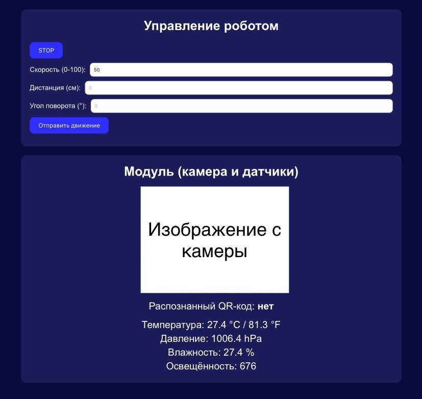
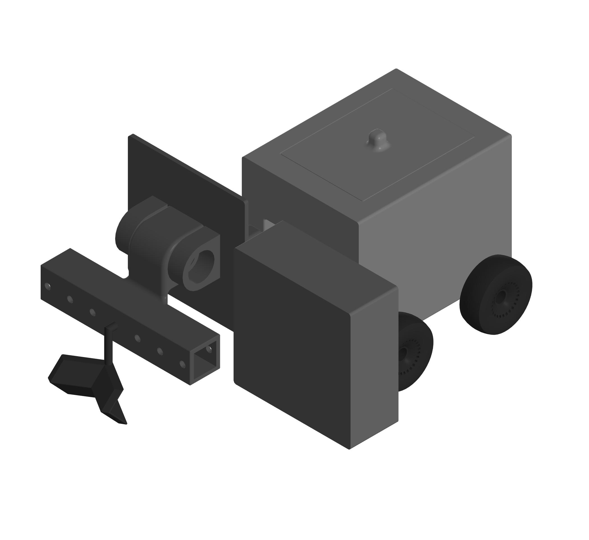

# Мультифункциональный аграрный робот

Мультифункциональный аграрный робот — это мобильное решение для выполнения разнообразных задач в сельском хозяйстве. Проект нацелен на автоматизацию работ на открытых полях и в теплицах с использованием современных технологий позиционирования, удалённого управления и компьютерного зрения.

---

## О проекте

Данный проект представляет собой разработку мобильного многофункционального робота, способного работать в сложных аграрных условиях. Он оснащён системой точного позиционирования и возможностью удалённого управления через интернет, что позволяет оператору задавать маршрут и оперативно реагировать на изменения в рабочей среде. Главное отличие робота — его модульность: универсальный интерфейс обеспечивает возможность быстрого подключения различных функциональных модулей для выполнения широкого спектра задач — от механической обработки почвы до мониторинга состояния растений и анализа окружающей среды.

---

## Функциональные возможности

- **Автономная навигация:**  
  - Управление движением с помощью Arduino Pro Mini, обработка данных с энкодеров и реализация PID-регуляции.
  - Точность навигации обеспечивается за счёт IMU-датчика GY-BNO055 и GPS-модуля ATGM336H.

- **Модульность:**  
  - Быстрая смена функциональных модулей (например, для механической обработки, мониторинга растений или анализа окружающей среды) без изменения базовой конструкции.

- **Удалённое управление:**  
  - Интеграция Arduino MKR GSM 1400 для подключения по GSM и ESP32-C3 Super Mini для работы с Wi-Fi и BLE позволяет оператору управлять роботом дистанционно.

- **Компьютерное зрение:**  
  - Использование Raspberry Pi 3 с камерой, Python и OpenCV для автоматического обнаружения и анализа состояния растений.

- **Сбор данных:**  
  - Встроенные датчики: APDS-9960 для измерения уровня освещённости, а также модуль BME280 для мониторинга температуры и влажности окружающей среды.

- **Прецизионное управление движением:**  
  - PID-регулятор и энкодеры на ТТ-моторах с драйверами TB6612FNG обеспечивают высокую точность управления.

- **Адаптивное шасси:**  
  - Четырёхколесное шасси с полным приводом гарантирует стабильное движение и преодоление неровностей местности.

---

## Инновации и практическая значимость

- **Инновационная модульность:**  
  Возможность адаптации робота под любые аграрные задачи за счёт смены функциональных модулей.

- **Увеличение урожайности:**  
  Автоматизация процессов снижает затраты на ручной труд и повышает общую продуктивность.

- **Универсальность применения:**  
  Робот успешно используется как на открытых полях, так и в теплицах, что делает его востребованным решением для малых агрохозяйств.

- **Перспективы развития:**  
  Планируется интеграция дополнительных датчиков (например, лидаров и парктроников) для перехода к полностью автономному управлению.

- **Открытая платформа:**  
  Проект открыт для сторонних разработчиков, которые могут интегрировать новые модули и расширять функциональность робота.

---

## Используемые технологии и компоненты

- **Микроконтроллеры:**  
  Arduino Pro Mini, Arduino MKR GSM 1400, ESP32-C3 Super Mini, Raspberry Pi 3

- **Навигация:**  
  IMU-датчик GY-BNO055, GPS-модуль ATGM336H, энкодеры

- **Связь:**  
  GSM (Arduino MKR GSM 1400), Wi-Fi и BLE (ESP32-C3 Super Mini)

- **Сенсоры:**  
  Датчик освещённости APDS-9960, модуль температуры и влажности BME280

- **Программирование:**  
  C++ для Arduino, MicroPython/Python для Raspberry Pi

- **3D-моделирование:**  
  КОМПАС-3D, 3D-печать из PETG

---

## Веб-интерфейс управления

Для удобства управления и мониторинга разработан веб-интерфейс, который позволяет:
- Удалённо управлять движением робота;
- Задавать и изменять траекторию;
- Отслеживать текущие показатели датчиков в реальном времени;
- Получать данные с модуля компьютерного зрения.

---

## Изображения проекта

---

## Вклад и развитие проекта

Мы приветствуем вклад сообщества и открыты для предложений по улучшению проекта. Если вы заинтересованы в сотрудничестве или у вас есть идеи для новых функциональных модулей, пожалуйста, создайте issue или отправьте pull request.

---

© 2025 — Все права защищены.